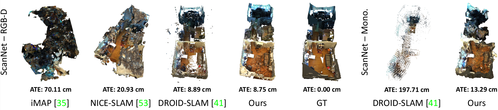
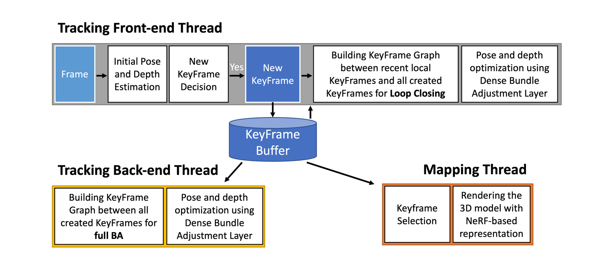
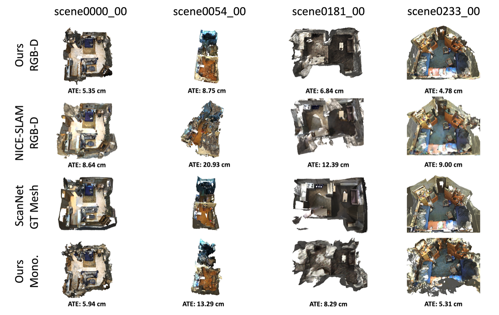
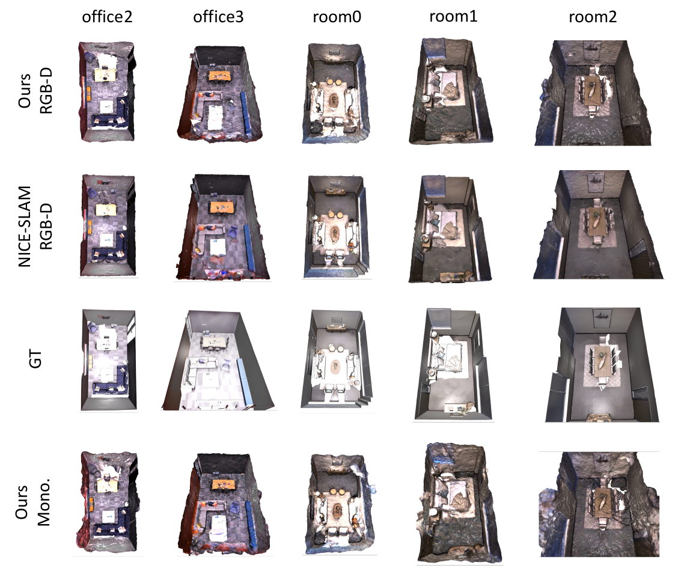
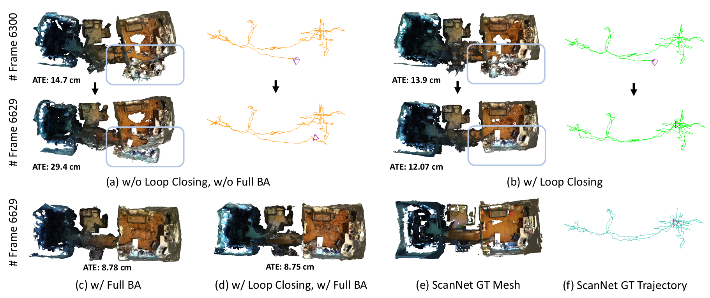

<h1 align="center"> GO-SLAM <br>Global Optimization for Consistent 3D Instant Reconstruction (ICCV 2023) </h1> 


:rotating_light: This repository contains the code and trained models of our work  "**GO-SLAM: Global Optimization for Consistent 3D Instant Reconstruction**",  [ICCV 2023](https://iccv2023.thecvf.com/)

**Note**: 🚧 Kindly note that this repository is currently in the development phase.

by [Youmin Zhang](https://youmi-zym.github.io/), [Fabio Tosi](https://fabiotosi92.github.io/), [Stefano Mattoccia](http://www.vision.disi.unibo.it/smatt/) and [Matteo Poggi](https://mattpoggi.github.io/)

Department of Computer Science and Engineering (DISI),
 University of Bologna


</div>

 <div style="text-align:center;font-size:30px;">
 <span style="color:red">Code coming soon!</span>
</div>

<div class="alert alert-info">

<h2 align="center"> 

[Project Page](https://youmi-zym.github.io/projects/GO-SLAM/) | [Paper]() |  [Supplementary]() 
</h2>


<p align="center">
  
</p>

**3D Reconstruction and Trajectory Error**. From left to right: RGB-D methods ([iMAP](https://arxiv.org/abs/2103.12352), [NICE-SLAM](https://github.com/cvg/nice-slam), [DROID-SLAM](https://github.com/princeton-vl/DROID-SLAM), and ours), ground truth scan, and monocular methods (DROID-SLAM and ours).


## :bookmark_tabs: Table of Contents

1. [Introduction](#clapper-introduction)
2. [Code](#memo-code)
3. [Qualitative Results](#art-qualitative-results)
4. [Contacts](#envelope-contacts)

</div>


## :clapper: Introduction


We introduce **GO-SLAM**, a deep-learning-based dense visual SLAM framework that achieves **real-time global optimization of poses and 3D reconstruction**. By integrating robust pose estimation, efficient loop closing, and continuous surface representation updates, GO-SLAM effectively addresses the error accumulation and distortion challenges associated with neural implicit representations. Through the utilization of learned global geometry from input history, GO-SLAM sets new benchmarks in tracking robustness and reconstruction accuracy across synthetic and real-world datasets. Notably, its versatility encompasses **monocular**, **stereo**, and **RGB-D** inputs..

**Contributions:** 

* A novel deep-learning-based, **real-time global pose optimization system** that considers the complete history of input frames and continuously aligns all poses.

* An **efficient alignment strategy** that enables instantaneous loop closures and correction of global structure, being both memory and time efficient.

* An **instant 3D implicit reconstruction** approach, enabling on-the-fly and continuous 3D model update with the latest global pose estimates. This strategy facilitates real-time 3D reconstructions.

* The first deep-learning architecture for joint robust pose estimation and dense 3D reconstruction suited for any setup: **monocular**, **stereo**, or **RGB-D cameras**.

**Architecture Overview** 

GO-SLAM consists of three parallel threads: **front-end tracking**, **back-end tracking**, and **instant mapping**. It can run with monocular, stereo, and RGB-D input.




:fountain_pen: If you find this code useful in your research, please cite:

```bibtex
@inproceedings{zhang2022goslam,
    author    = {Zhang, Youmin and Tosi, Fabio and Mattoccia, Stefano and Poggi, Matteo},
    title     = {GO-SLAM: Global Optimization for Consistent 3D Instant Reconstruction},
    booktitle = {Proceedings of the IEEE/CVF International Conference on Computer Vision (ICCV)},
    month     = {October},
    year      = {2023},
}
```

## :memo: Code

<span style="color:red;">The code will be available soon!</span>


## :art: Qualitative Results

In this section, we present illustrative examples that demonstrate the effectiveness of our proposal.


**Qualitative results on ScanNet dataset**. We evaluate our RGB-D mode SLAM using the ScanNet dataset and benchmark it against state-of-the-art techniques. Our method showcases improved global-consistency in reconstruction results.

<p float="left">
  
</p>

**Qualitative results on Replica dataset**. Supporting both Monocular and RGB-D modes, our GO-SLAM is evaluated on the Replica dataset. It achieves real-time, high-quality 3D reconstruction from monocular or RGB-D input. This stands in contrast to NICE-SLAM, designed solely for depth input, which operates at a frame rate of less than 1 per second and requires hours to achieve comparable outcomes.

<p float="left">
  
</p>

**Qualitatives examples of LC and full BA on scene0054 00 (ScanNet) with a total of 6629 frames.** . In (a), a significant error accumulates when no global optimization is available. With loop closing (b), the system is able to eliminate the trajectory error using global geometry. Additionally, online full BA optimizes (c) the poses of all existing keyframes. The final model (d), which integrates both loop closing and full BA, achieves a more complete and accurate 3D model prediction.

<p float="left">
  
</p>


## :envelope: Contacts

For questions, please send an email to youmin.zhang2@unibo.it, fabio.tosi5@unibo.it or m.poggi@unibo.it


## :pray: Acknowledgements

We sincerely thank the scholarship supported by China Scholarship Council (CSC). 